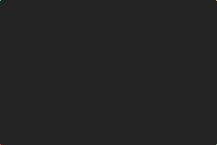
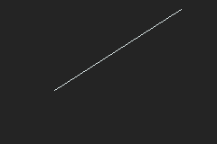
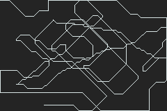

# practicing-gba-programming
A repository that I use to store and showcase finished and unfinished ideas and projects I build for the GBA in ARM.

**Note: unless a proper header is added, these programs will not work on real hardware (nor some emulators).**
I do not include the bitmap of the Nintendo logo in the header in order to avoid copyright infringement.
If you want to run these programs on an emulator, I'd recommend [No$gba](https://problemkaputt.de/gba.htm) or [mGBA](https://mgba.io/).

---

## Build Instructions

Assemble a program with the [Goldroad 1.7](https://www.gbadev.org/tools.php?showinfo=192) assembler:
```sh
goldroad.exe <program/program>.asm
```
Example:
```sh
goldroad.exe line/line.asm
```
**Note: you must be in the same directory as the header file ([`header.asm`](header.asm)) when building.**

---

## Program Descriptions

Name and Link | Screenshot (if applicable) | Description
------------- | -------------------------- | -----------
[Pixels](pixels) |  | This program displays a pixel of a different color on the corners of the screen. (They may be hard to see in the screenshot, but they're there!)
[Line](line) |  | This program displays any arbitrary line specified in the code. It uses my own implementation of Bresenham's line algorithm and can draw lines in all 8 octants.
[VBlank Test](vblank_test) |  | This program displays a line that extends and contracts at the top of the screen that only gets processed once per VBlank.
[DMA](dma) |  | This program uses DMA transfers to fill the screen with red-orange pixels. (I take the screenshots in No$gba, and it shifts the color slightly).
[Move Pixel](move_pixel) |  | This program reads the d-pad inputs to let the player move a pixel around. Because VRAM is not cleared, previous locations persist, and it looks like a drawing!
